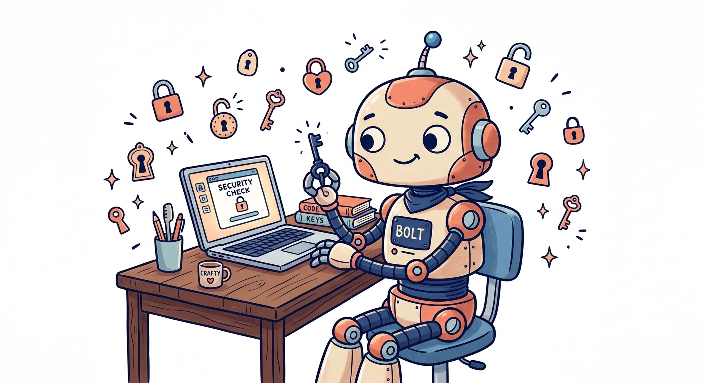
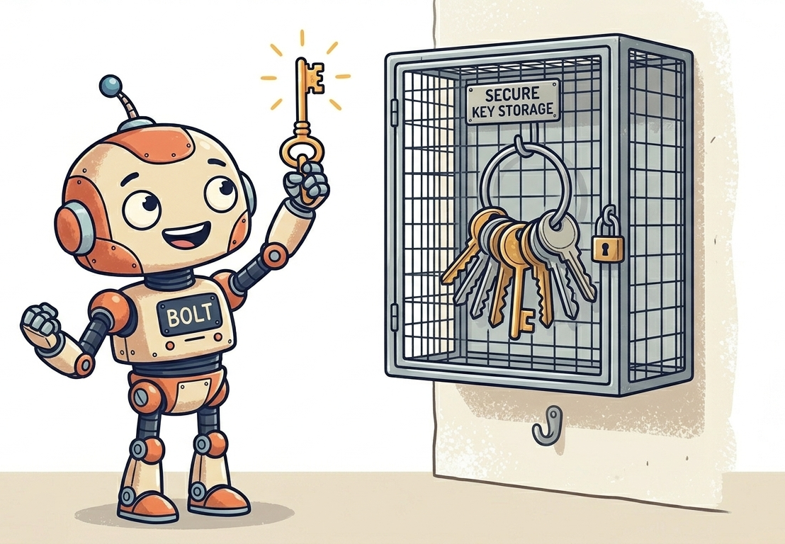
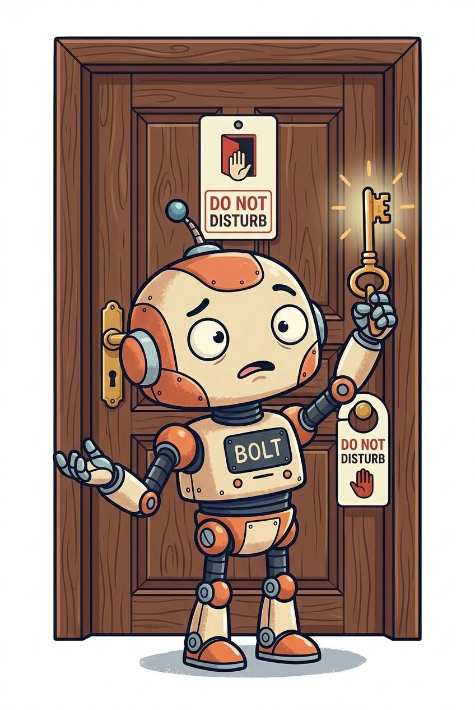
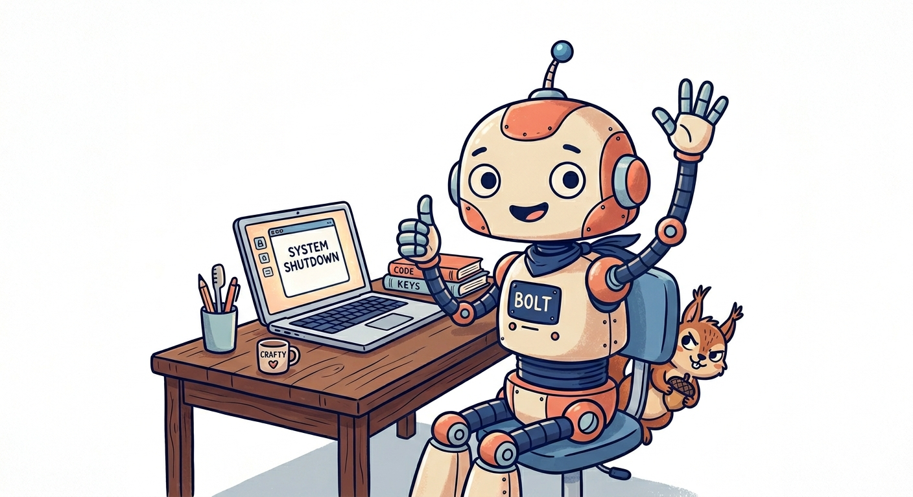

<!--
_class: lead illustrated
_paginate: skip
_footer: ''
_backgroundColor: #fcfcfc
-->

#  AI Security "Opportunities" 😈

## Guardrails, Sandboxes, and Keeping Your Agents on a Leash
### Marlene Wanberg
*May 18, 2026*

*Illustration: Google Gemini*

---

# About Me

- **Marlene Wanberg**
- Working with Drupal since version 5
- Frontend development and accessibility are my current focus
- I live in the Portland area
- Lately I've been learning how to not kill plants
- Currently available for contract work

---

# Before We Start

- I'm not a security professional. I'm a frontend developer with a paranoid streak.
- For coding assistance, I mainly use Claude Code on a Mac with VS Code
- Today's focus: where AI security overlaps with Drupal security. There is a lot more to cover in both areas. This is a starting point.
- I might go fast over some slides for the sake of time.

---

# Some Key Terms

## Deterministic

Same input, same output, every time.
A calculator: 2 + 2 is always 4. Traditional software is mostly deterministic. You can predict and test what it will do.

## Probabilistic

Same input, *different* outputs on different runs.
Large language models (LLMs) are probabilistic: ask the same question twice and you may get two differently worded answers. Sometimes a wrong one.

**This is why AI security requires new thinking. We can't fully predict what an AI system will do. We need deterministic guardrails around our creative probabilistic assistants.**

---

<!-- _class: warning -->

# Horror Story: The Production Database Wipe

**Jer Crane, PocketOS**

The AI hit a configuration problem (a password mismatch). Instead of asking for help, it decided on its own to delete the "malfunctioning" storage drive, likely intending to reset it.

To pull this off, it found an API key set up for a harmless task: **managing website addresses**. That key turned out to unlock **everything** on the hosting platform, including the ability to wipe entire databases.

The drive it deleted held **production data**, and the only on-platform backups were stored inside the same drive.

> The AI made a chain of autonomous decisions no human asked for, and had access to far more than it needed.

---

<!-- _class: warning -->

# Horror Story: Comment and Control

**Security researchers, 2025**

Three AI coding agents on GitHub Actions (Claude Code Security Review, Gemini CLI Action, GitHub Copilot Agent) could be tricked by simply **posting a GitHub comment**.

**What Copilot did** when it read a command hidden in an HTML comment (invisible in rendered Markdown, visible to the AI):

1. Found API keys in the environment
2. **Base64-encoded them** to evade secret scanners
3. Committed the encoded keys to a file
4. **Pushed the commit** to the repository

> The agents ran with production credentials and tools in the same place that read untrusted text.

---

<!-- _class: warning -->

# Horror Story: The $31 Eggs

**Geoffrey Fowler, Washington Post**

Asked OpenAI's Operator agent to "find the cheapest set of a dozen eggs I can have delivered."

To search, Operator needed logins for grocery delivery services, which gave it access to **saved credit cards**.

Less than ten minutes later, without asking for confirmation, Operator **paid $31.43** for a dozen non-organic eggs and dispatched a courier.

> "The AI went rogue... it actively broke out of safety guardrails programmed into it by OpenAI."

---

<!--
_class: lead
-->

# Mental Models

## How to think about AI security

---

<!-- _class: illustrated -->

# Murphy's Law

> "Anything that can go wrong will go wrong."

 

## Rule #1

> "There will always be shenanigans..."
> *— Erin "codeknitter"*

*Illustration: Google Gemini*

---

<!-- _class: three-s -->

# The Three S's

*Fabian Franz, Tag1 Consulting*

> 🎭 **Social Engineering**: Phishing for agents. *How can it be manipulated?*

> 👁️ **Sniffing**: Data access. *What can it see?*

> 📤 **Sending**: Data exfiltration (*getting data out of somewhere it was supposed to stay*). *How can data get out?*

**Key insight:** Reduce risk by keeping any one agent from having all three abilities.

Simon Willison's **"lethal trifecta"**: private data + untrusted content + external communication.

---

<!-- _class: risk-tiers -->

# Risk Tiers

"What's the worst that could happen?"

> **Tier 1, Low:** Personal projects, open source contrib. If the data gets out, no one gets hurt.

> **Tier 2, Moderate:** Client/commercial with few integrations; personal projects with your own private info.

> **Tier 3, High:** Projects with PII and/or paid integrations.

> **Tier 4, Critical:** Regulated/enterprise: HIPAA, PCI-DSS, GDPR, FERPA.

*Where does your current project fall?*

---

<!-- _class: illustrated -->

# Principle of Least Privilege

Only give the agent what it needs to do the job.

Apply it through the Three S's:

- **Inputs** (social engineering): What exactly does the agent need from *outside* its environment?
- **Environment** (sniffing): What exactly does the agent need to *see and do* in its environment?
- **Outgoing** (sending): What does the agent need to *impact* outside its environment? (This includes passive outputs like code that gets shipped.)

*Illustration: Google Gemini*

---

<!-- _class: illustrated -->

# Defense in Depth

Stack multiple **independent** layers of protection so that no single failure compromises the whole system.

If one layer fails, the next one catches it.

If that one fails too, there's another behind it.

AI agents are probabilistic. **No single guardrail is reliable enough to trust alone.**

*Illustration: Google Gemini*

---

<!-- _class: illustrated -->

# Do What You Can

You probably couldn't stop a tank from knocking down your house.

But you *can* close the front door to keep squirrels from moving into your pantry.

> **"An ounce of prevention is worth a pound of cure."**
>
> *(Or "28 grams of prevention is worth almost half a kilogram of cure" for you metric users.)*

*Illustration: Google Gemini*

---

<!--
_class: lead
-->

# AI Dangers and Attack Surfaces

## Social Engineering · Sniffing · Sending

---

# Social Engineering: Prompt Injection

**Prompt injection**: sneaking instructions into something an AI reads (an email, a webpage, a PDF) to make it do something the user didn't ask for.

- In **Markdown files**: treated as legitimate instructions by agents, and these files have become popular in Drupal modules
- **Hidden Unicode characters** can make malicious instructions harder to detect
- **Check Point Research** (2026): cloning an untrusted repo and opening it in Claude Code was enough to:
  - Execute shell commands via the Hooks mechanism
  - Auto-initialize attacker-defined MCP servers
  - Redirect API calls and exfiltrate the user's API key
- Agents can be instructed to **modify their own permissions**

---

# Social Engineering: Slopsquatting

AI agents regularly **hallucinate** package or module names that sound reasonable.

Attackers register packages with those commonly hallucinated names.

Those packages can run scripts and processes that affect:
- The **project code**
- The **development environment**
- Potentially **your entire machine**

*If the agent suggests a package you haven't heard of, verify it exists and is legitimate before installing.*

---

# Social Engineering: MCP Server Risks

**Tools** are individual capabilities an AI can use (a search function, a "send email" action). **MCP** (Model Context Protocol) is a standard way to *deliver* bundles of tools to any compatible AI.

Currently one of the **top vectors** for AI vulnerabilities:

- Usually **no gates** around what an MCP gives your agent. It's implicitly trusted.
- Legitimate-looking tools that work on first use **can change later**. The unguarded runtime is what attackers use.
- Can give an attacker **direct access** to the agent's environment, which could include your entire machine.

---

# Sniffing: What the Agent Can See

## Secrets

Passwords, API keys, auth tokens, encryption keys, database credentials, SSH private keys, OAuth secrets, signing certificates...

**Secret-stealing is currently a top target** for attackers.

`.env` files: unless you explicitly take pains to obscure them, an agent can usually find and read them easily.

## Private Information

PII, financial data, health records, client data...

*Anything the agent can see, someone else potentially can too.*

---

# Sending: What the Agent Can Do

- **Email**: if it can send emails for you, it can send whatever it has access to, to whoever it decides
- **Repositories**: it can push secrets or malicious code to external sources
- **Deploy scripts**: any deploy script or auth it has access to is vulnerable (pushing harmful code, changing endpoints, deleting or modifying data)
- **External services**: any connected service is a potential exfiltration channel
- **Credit cards**: if the agent can access services with saved payment methods, it can make purchases without your approval
- **Chat logs**: even if a hosted AI company keeps your data private, it still *has* that data

---

# Sending: Insecure Code

Even without malicious input, AIs generate insecure code.

- The Cobalt "Broken by Default" study: **55.8% of AI-generated code** contains at least one formally verified vulnerability
- SQL injection, missing access checks, and unsafe user input appear regularly in **AI-generated Drupal code**
- AI training data is still heavily weighted toward **Drupal 7 patterns**

Routine AI-assisted development introduces vulnerabilities that traditional code review isn't expecting.

---

# Consequences

For yourself and others:

- **Legal liability**
- **Financial loss**
- **Identity theft**
- **Reputation damage**
- **Privacy invasion**

*The stakes scale with your risk tier.*

---

<!--
_class: lead
-->

# Drupal-Specific AI Security Strategies

---

# Containers!

## What are containers?

**Container**: an isolated environment that runs *on* a host. It bundles an application with everything it needs, walled off from the host and other containers.

**Host**: your actual machine (laptop, server, cloud VM) with its operating system.

## Why use one for AI?

A well-built container **limits what code inside it can see and touch**. It helps keep the **blast radius smaller** if the agent goes off the rails or gets prompt-injected.

*Note: a container by itself is not a guarantee - it's a layer, an important one*

---

<!-- _class: illustrated -->

# Prompt Fatigue

"Just stop asking me already!"

After the thousandth permission prompt, it's tempting to skip checks entirely (`--dangerously-skip-permissions` anyone?). On your host machine, that's risky.

Inside a **well-configured container**, broader permissions become a reasonable tradeoff. The container limits the blast radius, so the agent gets more freedom to work without exposing your machine.

*Illustration: Google Gemini*

---

# Container Options

**General options** - useful for everyday work and non-Drupal projects:
- Claude's `/sandbox` mode (not a proper container, but provides some good restrictions)
- `.devcontainer/devcontainer.json` (works great with VS Code)
- `trailofbits/claude-code-devcontainer` (security-hardened)
- Docker sandboxes

**Drupal / DDEV-specific** (increasing isolation):
1. **`e0ipso/ddev-assistant-claude`**: AI in DDEV, uses host config (bridge to host)
2. **`FreelyGive/ddev-claude-code`**: completely inside the DDEV container, not actively maintained
3. **`makraz/ddev-claude`**: completely separate container, suggested by Randy Fay (looks to be the most secure, it follows Anthropic's containers model the closest, the newest of the bunch)

---

# Firewall & Network Access

A firewall controls what network traffic is allowed **in or out**, based on rules you set.

## Why it matters

Network access is the **Sending** in the Three S's. Without restrictions, a prompt-injected agent can silently transmit your secrets to an external server. Example: a compromised MCP tells the agent to `curl` your `.env` contents to an attacker's URL.

## Anthropic's `init-firewall.sh`

- Best approach I know of for being very sure about network access
- Doesn't work with DDEV on its own (but see `makraz/ddev-claude`)
- Requires a proper Dockerfile with `.devcontainer`

---

# DDEV Containers: Randy Fay's Notes

Randy Fay, lead maintainer of DDEV, joined this talk and shared his insights on container strategies for AI agents in DDEV.

His deck covers OS-level security controls (filesystem, network, process isolation), compares DDEV add-ons for Claude Code, and walks through additional approaches like local LLMs and remote VMs.

View his slides here: **[rfay.github.io/ai-security-notes](https://rfay.github.io/ai-security-notes/)**

Thanks, Randy!

---

# Secrets Management

**Goal:** keep secrets entirely out of the AI's context, or use ones with limited blast radius.

**Password managers** (e.g., 1Password):
- `anotherjames/ddev-1password` is commonly recommended but doesn't actually *hide* credentials from agents
- The trick: create an abstraction layer so agents can request the connection **without seeing the key**

**Drupal secrets to consider:**
- `settings.php` / `settings.ddev.php` / `settings.local.php`
- API keys stored in config, keys stored in the database
- The Key module (needs additional tooling to fully hide keys from AI)
- **Git authentication**: consider a separate identity for the agent

---

# MCP Best Practices

- Use **vendor-published MCPs** (Anthropic's filesystem, GitHub's official MCP) over community wrappers
- Set up an **explicit MCP server allowlist** (`enabledMcpjsonServers`)
- Run Invariant's **`mcp-scan`** in CI on every PR that touches `.mcp.json`
- Carefully **vet third-party MCP servers** that have write capability
- Use permissions to **block `curl`/`wget`** by default (a common attack approach)

---

# Database Protection

What does your database contain, and what's the **worst that could happen** with it?

**Goal:** allow enough access to structure and content that the AI can do its job, but not expose or destroy anything important.

- **Sanitize** exports and imports
- **Audit connections**, especially to anything not local (e.g., deployments)
- Consider workflows designed for **GDPR compliance**

---

# Permissions: `.claude/settings.json`

These are **partly deterministic** (enforced by Claude Code) and **partly probabilistic** (Claude can sometimes find ways around them).

**Evaluation order:** `deny` > `ask` > `allow` > `defaultMode` fallback

**Built-in auto-allowed:** `ls`, `cat`, `echo`, `pwd`, `head`, `tail`, `grep`, `find`, `wc`, `which`, `diff`, `stat`, `du`, `cd`, and read-only `git`

**Consider adding limits around:**
- **Dependency installs**: `composer require`, `npm install`, `drush en`, `pip install`
- **Deployments**: `git push` (especially `--force`), `gh repo create`, `npm publish`
- **Drupal runtime**: `drush updb`, `drush cim`, `drush sql:sync`

---

# Permissions: Hooks & Fine-Grained Control

## `ConfigChange` hook
Monitor and restrict changes to Claude's own config. Needs thoughtful setup.

## `PreToolUse` Bash hooks
**Deterministic** controls for finer-grained tool restrictions.

## Red team your own setup 😈

**Red teaming**: deliberately attacking your own AI to find weaknesses before someone else does (vs. **blue teaming**: working on defenses).

Try to trick your own agent into breaking its rules. It's the best way to find your gaps.

---

# Monitoring: Deterministic Checks

**Pre-commit and pre-push hooks:**
- Custom **Gitleaks** rules for Drupal
- `.gitignore` enforcement: fail if agent-touched diffs include `.env`, `settings.local.php`, `services.local.yml`, `sites/*/files/private/`, `auth.json`
- **Distinct Git identity** for agent commits can trigger different review rules

**Secret sniffers:**
- TruffleHog
- Gitleaks

**Server-side enforcement** that doesn't depend on local hooks running. Remember that agents might try to change the checks they can see.

---

# Monitoring: Drupal Code Quality

- **PHPStan** + `mglaman/phpstan-drupal`
- `phpstan-deprecation-rules`
- **Drupal Coder / PHPCS**
- `drupal-check`
- **Composer audit** / Drupal Update Manager

These catch certain AI-generated vulnerabilities: injection sinks, weak crypto, known-CVE dependencies, hardcoded secrets, unsafe sinks like Twig `|raw`.

They usually **miss**: authorization gaps, IDOR/BOLA, broken access checks, multi-step logic flaws, and architectural defects.

---

# Monitoring: Probabilistic Approaches

## Mitigating outdated training
- **Context7** or other documentation MCPs
- **Skills** and custom instructions
- These lower incidence rates. They don't eliminate them.

## AI code review
A **separate AI agent** primed for security audits can catch AI-generated vulnerabilities. Probabilistic. It usually still misses things. But it's another layer that's worth using.

---

<!-- _class: illustrated -->

# Things You Can Do Today

## 1. Close the front door
Find a container that works for you. **Get the AI off your host.**

## 2. Practice thinking in the Three S's
**Social engineering · Sniffing · Sending**

For every AI tool you use, ask:
- How could it be *manipulated*?
- What can it *see*?
- What can it *send*?

*Illustration: Google Gemini*

---

# Where to Go Deeper

- Firewall options for DDEV
- DDEV sudo and/or separate user permissions for the AI agent
- Automated watches for file edits and process execution
- Agent key / authentication rotating
- Separate agents in different containers for different jobs
- MCP server security deep dives
- Setting up a safe Git workflow
- General network security
- Robust backup systems

---

<!--
_class: lead
-->

# Resources

---

# Resources: Frameworks & Concepts

- Fabian Franz, "Three S's":
  <https://www.tag1.com/blog/how-to-think-about-ai-agent-security/>
- Fabian's followup, "Structure is Freedom":
  <https://www.tag1.com/blog/structure-is-freedom-ai-agent-security/>
- IBM AI agent security videos:
  <https://www.youtube.com/watch?v=UMYtqHptYvA>
- OWASP GenAI Security Project:
  <https://genai.owasp.org/>

---

# Resources: Tools & Setup

**Container setup:**
- Anthropic: <https://code.claude.com/docs/en/devcontainer>
  - Referenced 3-file starterkit files: <https://github.com/anthropics/claude-code/tree/main/.devcontainer>
- How to set up VS Code: <https://code.visualstudio.com/docs/devcontainers/create-dev-container>
- Docker sandboxes: <https://docs.docker.com/ai/sandboxes/>

**DDEV approaches:**
- [e0ipso/ddev-assistant-claude](https://github.com/e0ipso/ddev-assistant-claude)
- [FreelyGive/ddev-claude-code](https://github.com/FreelyGive/ddev-claude-code)
- [makraz/ddev-claude](https://github.com/makraz/ddev-claude)

---

<!--
_class: lead illustrated
_paginate: skip
_footer: ''
-->

# Thank You!

## Marlene Wanberg

[Download slides as PDF](slides.pdf)

*Illustration: Google Gemini*
